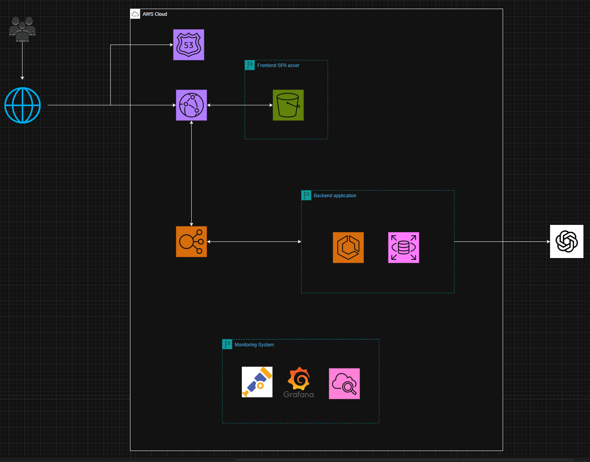

## System Architecture

 <!-- Replace with your diagram path -->

This project is deployed on **AWS Cloud** with a **frontend-backend separated architecture**, integrated with AI analysis to provide a Fitness & Nutrition Tracking System.

---

### **1. Route 53**
- Acts as the DNS service, routing user requests to the correct frontend (CloudFront) or API (ALB).
- Supports HTTPS and custom domains:
  - `app.myfitnessapp.com` → Frontend
  - `api.myfitnessapp.com` → Backend API

### **2. CloudFront (CDN)**
- Serves as the global CDN for both static assets and API request forwarding.
- Multiple origin setup:
  - Static assets → **S3**
  - API requests (`/api/*`) → **Application Load Balancer**

### **3. S3 (Frontend Hosting & Image Storage)**
- **Frontend Hosting**: Stores Angular build artifacts for static website hosting.
- **Image Storage**: Stores uploaded meal images, accessed securely via Pre-signed URLs.

### **4. Application Load Balancer (ALB)**
- Handles API requests and routes them to **ECS Fargate** backend containers.
- Health checks ensure service availability.

### **5. ECS Fargate (Backend API)**
- Runs containerized .NET 8 API for business logic and data processing.
- Connects to **RDS** for persistent storage of user, meal, and workout data.
- Integrates with **OpenAI API** to provide AI-generated insights.

### **6. RDS (PostgreSQL)**
- Relational database storing:
  - User profiles
  - Meal logs
  - Workout records
  - Cached AI analysis results

### **7. OpenAI API**
- Generates personalized nutrition and workout suggestions based on user data.

---

## Request Flow
1. User accesses the system via a custom domain (resolved by Route 53).
2. **Frontend requests**:
   - CloudFront serves Angular static assets from S3.
3. **API requests**:
   - CloudFront forwards `/api/*` to ALB.
   - ALB routes traffic to ECS Fargate backend containers.
   - Backend reads/writes data from RDS or accesses images from S3.
4. AI analysis requests are sent from ECS to OpenAI API, and the generated suggestions are returned to the frontend.

---

## Key Advantages
- **Scalability**: ECS Fargate automatically scales compute resources.
- **Cost-efficiency**: Leverages AWS Free Tier (S3, CloudFront, RDS Free Tier).
- **Security**: Pre-signed URLs, private subnet RDS, strict security group access.
- **High Availability**: Global CDN with CloudFront, ALB health checks.
